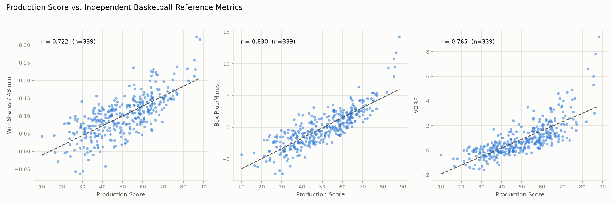
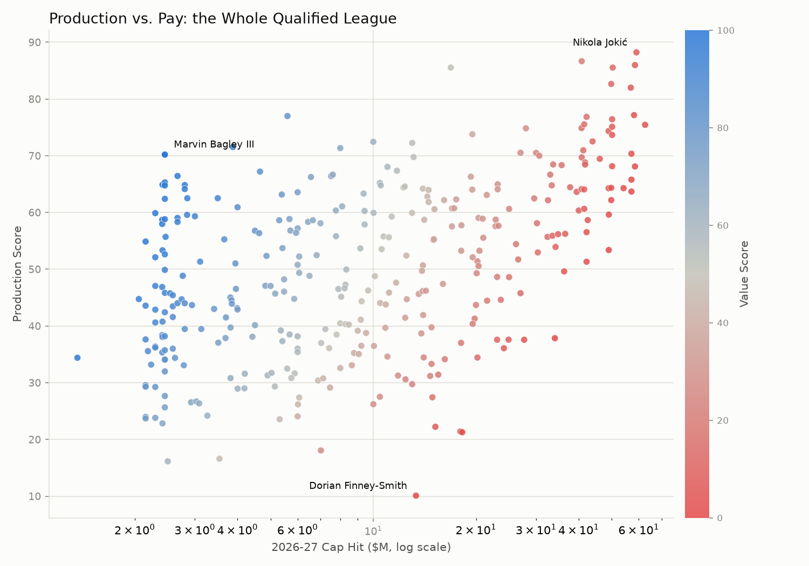
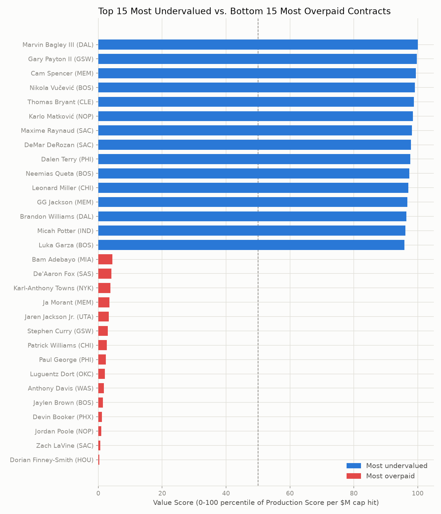
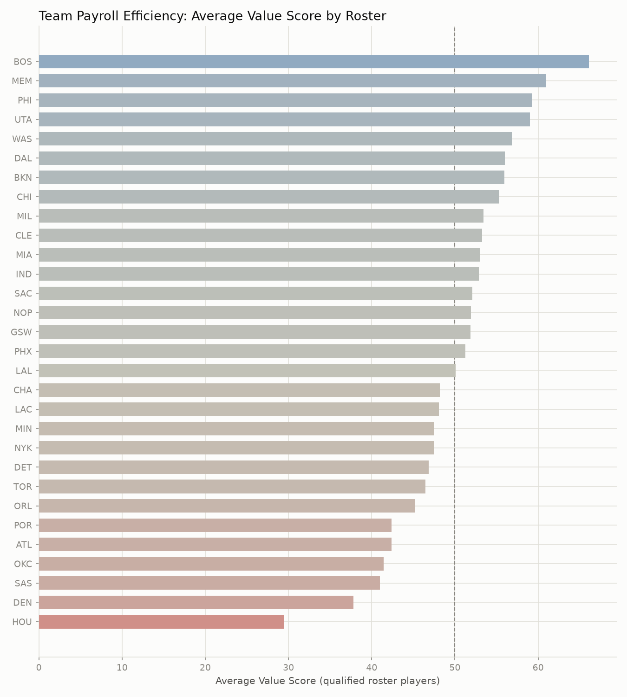

# NBA Undervalued Assets Model


A contract-value efficiency model for the NBA: it combines real player production
stats with real salary/cap data to compute a **Value Score** (production per
dollar of cap hit), then ranks the most and least efficient contracts in the
league.

## 1. What this measures, and why it's a real analytics question

"Who's good?" is a solved, boring question -- box scores and All-NBA voting
already answer it. The harder, more useful question front offices actually
pay analysts to answer is **"who is worth their contract?"** A max-salary
superstar can be an excellent player and a bad value at the same time if the
price is high enough; a minimum-salary rotation piece can be a mediocre
player and a great value for the same reason. Those are different questions,
and this project only answers the second one.

Concretely, this pipeline:

1. Builds a **Production Score** (0-100) from a defensible, documented blend
   of role- and pace-normalized advanced stats -- not just "who racked up the
   most counting stats by playing the most minutes."
2. Divides it by the player's current cap hit to get a **Value Score**
   (0-100): how much production a team is getting per dollar, relative to
   the rest of the league.
3. Checks that the Production Score isn't just noise by correlating it
   against Basketball-Reference's Win Shares/48, Box Plus/Minus, and VORP --
   three established, independently-built all-in-one metrics it shares no
   inputs with.

This is intentionally **not** a "who's the best player" leaderboard. Reigning
MVP-caliber players on max contracts show up near the *bottom* of the Value
Score ranking in this run, and that is the model working correctly, not a
bug -- see [Sample output](#7-sample-output) and
[Reading the results](#reading-the-results).

## 2. Data sources

| Source | What we pull | Currency |
|---|---|---|
| [`nba_api`](https://github.com/swar/nba_api) (wraps stats.nba.com) | Per-game totals (for a minutes/games qualification filter), Per-36 counting stats, and Advanced per-game stats (TS%, USG%, AST%, REB%, team TOV%, PIE) for the **2025-26 regular season** | Season is complete (82 team-games played); pulled live at pipeline run time |
| [Basketball-Reference `/contracts/players.html`](https://www.basketball-reference.com/contracts/players.html) | Every player's **2026-27** salary (their currently active/upcoming cap hit) and guaranteed-money total. Basketball-Reference credits Spotrac as the original compiler of contract terms; we pull the resulting table directly from basketball-reference.com rather than scraping Spotrac's own site. | Live HTML table, pulled at run time; reflects signings/extensions/trades as of the run date |
| [`sumitrodatta/bball-reference-datasets`](https://github.com/sumitrodatta/bball-reference-datasets) (`Data/Advanced.csv`) | Win Shares, Win Shares/48, Box Plus/Minus, VORP for **benchmarking only** (see [Methodology](#3-methodology)) | Actively-maintained CSV mirror of Basketball-Reference's season tables, re-scraped regularly; used here for the 2025-26 (`season == 2026`) rows |

We deliberately avoided scraping a dedicated commercial contract-tracking
site (Spotrac, HoopsHype) directly. Basketball-Reference's contracts table is
a single, low-request-volume, well-structured page on a general
sports-reference site the project already depends on for the benchmark data,
which keeps the whole data footprint to a handful of polite HTTP requests.

**How current is the salary data?** As current as Basketball-Reference's
table is at pipeline run time. Two structural gaps worth knowing about: (a)
draft picks and free agents without a finalized 2026-27 number yet are
absent from the table entirely (not a bug -- see
[Limitations](#5-limitations)), and (b) a trade or signing that happens
between a pipeline run and when you read its output won't be reflected until
the next run.

## 3. Methodology

### Production Score

Every input is either already a rate/percentage stat or a per-36-minutes
figure -- nothing here rewards a player just for playing more minutes than
someone else. Each component is converted to a **percentile rank (0-100)
within the qualified player pool** (see below) before weighting, which
bounds the final score to `[0, 100]`, keeps every component on the same
unitless scale, and is robust to the kind of small-sample outlier a raw
z-score would blow up on.

| Component | Weight | Why |
|---|---|---|
| True Shooting % | 25% | The single best all-around scoring-efficiency number -- folds in 3pt and FT value, unlike raw FG%. Weighted highest because scoring inefficiently at high volume is the classic way a box score overstates a player's value. |
| Points per 36 min | 15% | Still credits real scoring output, at a role-normalized rate instead of a raw, minutes-biased total. |
| Assist % | 15% | Share of teammate field goals assisted while on the floor -- already pace-adjusted, unlike raw assists per-36. |
| Rebound % | 10% | Same logic as Assist %, applied to rebounding. |
| (Steals + Blocks) per 36 min | 10% | Standard box-score proxy for defensive event-making. Blended into one component so a shot-blocker and a high-steal wing aren't split across two under-weighted stats. |
| Team Turnover % (inverted) | 10% | Turnovers per 100 plays used; already usage-normalized. Inverted (`100 - percentile`) because giving the ball away is a cost, not a contribution. |
| Usage % | 5% | A deliberately small, positive weight -- carrying a larger offensive load is a real, distinguishable skill/role, but usage alone isn't "good" and shouldn't be rewarded heavily; TS% (5x the weight) keeps inefficient volume in check. |
| PIE (Player Impact Estimate) | 10% | stats.nba.com's own all-in-one box-score-share metric, included as a moderate-weight holistic sanity check rather than the headline number. |

Weights are defined in [`config.yaml`](config.yaml) and validated at runtime
to sum to 1.0.

**Qualification filter:** players need at least **500 minutes** and **20
games** in 2025-26 to be scored at all (also in `config.yaml`). Percentile
ranks are computed only within this qualified pool. See
[Limitations](#5-limitations) for what this does and doesn't fix.

### Value Score

```
value_ratio = production_score / (cap_hit / $1,000,000)
value_score = percentile_rank(value_ratio) * 100
```

A raw ratio is dominated by rookie-scale and minimum-salary players -- a
solid role player on a $2M deal can post a raw ratio 10-20x higher than an
equally-good player on a max deal, purely from the denominator. That's a
real pattern (rookie-scale contracts genuinely are where most surplus value
lives), but it makes a *raw* ratio useless as a "readable 0-100" scale,
since a few extreme cheap-labor outliers would compress everyone else into
the bottom few points. Converting to a percentile rank keeps the 0-100 scale
meaningful regardless of how extreme the tails get: a Value Score of 90
means "top 10% of qualified players in production generated per dollar
spent," full stop.

### Why the benchmark doesn't feed the score (and vice versa)

Win Shares, BPM, and VORP are **not** available from `nba_api`/stats.nba.com
at all -- they're Basketball-Reference-proprietary derived metrics, built
from a different data pipeline (play-by-play regressions, marginal
offense/defense estimates) than anything stats.nba.com publishes. That
turned out to be useful rather than a limitation: it means the Production
Score and the benchmark metrics are fully independent by construction, so a
correlation between them is actual evidence the Production Score captures
real signal, not a tautology from partially reusing the same inputs.

## 4. Benchmark result

The Production Score (percentile-weighted, built entirely from stats.nba.com
inputs) was correlated against three independent Basketball-Reference
metrics for the same 2025-26 qualified-player pool (n=339):

| Benchmark metric | Pearson r | What it's built from |
|---|---|---|
| **Box Plus/Minus (BPM)** | **0.830** | A box-score regression trained against play-by-play plus/minus |
| **VORP** | **0.765** | BPM scaled by share of team minutes played, translated to a wins-like scale |
| **Win Shares / 48 min** | **0.722** | Marginal offensive/defensive win contribution vs. league average |

All three are strong, honestly-reported positive correlations against
metrics that share zero inputs with the Production Score. BPM -- the
benchmark closest in spirit to the Production Score's rate-based,
role-normalized design -- has the strongest relationship (r=0.83, roughly
69% shared variance). VORP correlates a bit less tightly (r=0.765), which
is expected: VORP partially rewards durability/minutes share, something the
Production Score deliberately does not do. These numbers are regenerated
every pipeline run and written to `reports/benchmark_correlations.json`; the
values above are from the run this README's sample output was generated
from.



## 5. Limitations

Read this before treating the leaderboard as gospel.

- **Defense is underrepresented.** Steals and blocks per-36 are the only
  direct defensive signal in the Production Score. They miss almost
  everything about point-of-attack defense, positioning, and
  defensive-scheme value that doesn't show up as a steal or a block.
  Basketball-Reference's own advanced metrics have the same weak spot; this
  is a known, hard, league-wide measurement problem, not something this
  project claims to have solved.
- **Small samples are noisy even after the qualification filter.** The
  500-minute / 20-game bar screens out garbage-time flukes and two-game
  call-ups, but a player who was good for 25 games before a season-ending
  injury, or who had an unusually hot/cold shooting stretch across ~500
  minutes, can still be over- or under-rated relative to their true talent
  level.
- **Rookie-scale and minimum-salary deals structurally dominate the "most
  undervalued" list.** This is a real, expected property of any
  production-per-dollar metric (the denominator is small by design under
  the current rookie-scale/minimum-salary rules), not a bug -- but it means
  the top of the leaderboard says more about *rookie-scale-contract
  efficiency* specifically than about hidden gems league-wide. A star
  playing on a below-market veteran extension (see LeBron James, ranked
  #32 of 340 in this run at a $3.9M cap hit) is a more interesting
  "undervalued" case than most of the top-15 list.
- **Salary-side coverage gaps are real, not silently dropped.** Restricted
  free agents and rookies without a finalized 2026-27 number at scrape time
  (in this run: e.g. Bennedict Mathurin, Jaden Ivey, Jalen Duren -- all
  entering restricted free agency) are absent from Basketball-Reference's
  contracts table itself, not lost in our matching step. They cannot be
  scored on cap efficiency until they sign. `reports/reconciliation_report.md`
  lists every such player from both sides of every pipeline run.
- **Two seasons apart, by design, with a real caveat.** The Production Score
  uses *completed* 2025-26 stats; the Value Score divides by the *currently
  active* 2026-27 cap hit. That's a deliberate choice (both numbers are
  settled, and it answers "is this player's current paycheck justified by
  what he just did"), but it means a player who got a big raise or pay cut
  between seasons is being judged on the season *before* that change, not
  the one it applies to.
- **Name matching is heuristic.** `src/reconcile.py` normalizes accents,
  punctuation, and suffixes, plus a small manual alias table for known
  nickname mismatches (e.g. stats.nba.com's "Ronald Holland II" vs.
  Basketball-Reference's "Ron Holland" -- a real mismatch this project's own
  pipeline run surfaced). Every unmatched name from both sides is logged to
  `reports/reconciliation_report.md` rather than silently dropped, but a
  genuinely new mismatch pattern could still slip through unnoticed until
  someone checks that report.
- **This is a portfolio project, not a scouting tool.** It's meant to
  demonstrate a rigorous, documented approach to combining messy real-world
  data sources into a defensible metric -- not to be the last word on any
  specific player's contract.

## 6. Quickstart

Requires Python 3.11+.

```bash
git clone https://github.com/acramos1914-gif/nba-undervalued-assets-model.git
cd nba-undervalued-assets-model
python -m venv .venv
source .venv/Scripts/activate   # Windows Git Bash; use .venv/bin/activate on macOS/Linux
pip install -r requirements.txt

# Run the full pipeline: fetch live data -> reconcile -> score -> benchmark -> report
python -m src.pipeline run

# Re-run using the already-downloaded data/raw/*.csv instead of hitting live APIs
python -m src.pipeline run --skip-fetch
```

Outputs land in `reports/`:

- `leaderboard.csv` -- every qualified player, ranked by Value Score
- `value_chart.png` -- top/bottom-N bar chart
- `value_scatter.png` -- whole-league Production Score vs. cap hit
- `benchmark_scatter.png` -- Production Score vs. WS/48, BPM, VORP (section 4)
- `team_value.png` -- average Value Score by team
- `benchmark_correlations.json` -- the correlation numbers from section 4
- `reconciliation_report.md` -- every player who failed to match across sources

Run the test suite (fixture data only, no live API calls):

```bash
pytest -v
```

## 7. Sample output

From a full pipeline run on 2025-26 season stats and 2026-27 cap hits
(410 players matched across sources, 340 cleared the qualification filter).
Full data in `reports/leaderboard.csv`.



### Top 15 most undervalued

| Rank | Player | Team | 2026-27 Cap Hit | Production Score | Value Score |
|---|---|---|---|---|---|
| 1 | Marvin Bagley III | DAL | $2.45M | 70.3 | 100.0 |
| 2 | Gary Payton II | GSW | $2.45M | 70.2 | 99.7 |
| 3 | Cam Spencer | MEM | $2.41M | 64.9 | 99.4 |
| 4 | Nikola Vučević | BOS | $2.45M | 65.3 | 99.1 |
| 5 | Thomas Bryant | CLE | $2.45M | 64.8 | 98.8 |
| 6 | Karlo Matković | NOP | $2.30M | 59.9 | 98.5 |
| 7 | Maxime Raynaud | SAC | $2.15M | 54.9 | 98.2 |
| 8 | DeMar DeRozan | SAC | $2.45M | 62.4 | 97.9 |
| 9 | Dalen Terry | PHI | $1.36M | 34.4 | 97.6 |
| 10 | Neemias Queta | BOS | $2.67M | 66.4 | 97.4 |
| 11 | Leonard Miller | CHI | $2.41M | 58.7 | 97.1 |
| 12 | GG Jackson | MEM | $2.41M | 58.0 | 96.8 |
| 13 | Brandon Williams | DAL | $2.45M | 58.8 | 96.5 |
| 14 | Micah Potter | IND | $2.80M | 64.8 | 96.2 |
| 15 | Luka Garza | BOS | $2.80M | 64.1 | 95.9 |

### Bottom 15 most overpaid

| Rank | Player | Team | 2026-27 Cap Hit | Production Score | Value Score |
|---|---|---|---|---|---|
| 340 | Dorian Finney-Smith | HOU | $13.34M | 10.1 | 0.3 |
| 339 | Zach LaVine | SAC | $48.97M | 53.4 | 0.6 |
| 338 | Jordan Poole | NOP | $34.04M | 37.9 | 0.9 |
| 337 | Devin Booker | PHX | $57.08M | 63.7 | 1.2 |
| 336 | Jaylen Brown | BOS | $57.08M | 65.8 | 1.5 |
| 335 | Anthony Davis | WAS | $58.46M | 68.1 | 1.8 |
| 334 | Luguentz Dort | OKC | $18.22M | 21.3 | 2.1 |
| 333 | Paul George | PHI | $54.13M | 64.3 | 2.4 |
| 332 | Patrick Williams | CHI | $18.00M | 21.4 | 2.6 |
| 331 | Stephen Curry | GSW | $62.59M | 75.4 | 2.9 |
| 330 | Jaren Jackson Jr. | UTA | $49.00M | 59.6 | 3.2 |
| 329 | Ja Morant | MEM | $42.17M | 51.3 | 3.5 |
| 328 | Karl-Anthony Towns | NYK | $57.08M | 70.4 | 3.8 |
| 327 | De'Aaron Fox | SAS | $49.80M | 62.2 | 4.1 |
| 326 | Bam Adebayo | MIA | $49.80M | 64.3 | 4.4 |



### Team payroll efficiency

Rolling the same Value Scores up by roster shows which front offices are
getting the most production per dollar across their qualified players, not
just which single player has the best or worst deal:



Boston tops this list on the strength of a deep, cheap bench (Vučević,
Queta, Garza, Payton II all landed in the top-15 undervalued table above)
layered under a still-productive core. Houston sits last, largely on the
back of Dorian Finney-Smith's contract -- the single worst individual Value
Score in the league this run. A team average over roughly 8-15 qualified
players per roster is a small sample on its own; read this chart as a
snapshot of this run's roster construction, not a stable front-office
grade.

### Reading the results

Notice the "most overpaid" list is full of good-to-great players
(Production Scores mostly in the 60s-70s, well above league average),
several coming off injury-affected 2025-26 seasons (Curry, Davis, AD, Ja
Morant). That's the metric doing exactly what it's supposed to: at a
$50-60M cap hit, even a very good season isn't enough production-per-dollar
to look efficient next to a $2.5M rotation player having a solid year. For
comparison, the league's actual highest Production Score (Nikola Jokić,
88.2) still only ranks #313 of 340 in Value Score, because his $59M cap hit
outweighs it -- see [Limitations](#5-limitations) for why the "undervalued"
list skews toward rookie-scale deals rather than hidden All-Stars.

## Design notes

Decisions made without pausing for approval, and the reasoning behind them:

- **Season choice:** 2025-26 stats (just completed) vs. 2026-27 cap hits
  (currently active). Both are the most recent *settled* numbers available
  as of this writing (September 2026, before the 2026-27 season tips off).
- **Salary source:** Basketball-Reference's `/contracts/` table over a
  dedicated GitHub-hosted salary CSV. A search for an actively-maintained,
  current-season salary CSV on GitHub turned up nothing reliably
  current/complete enough (most were historical/prediction datasets, several
  seasons stale); Basketball-Reference's own contracts page is single-page,
  low-request-volume, and already in the project's dependency graph for the
  benchmark data.
- **Benchmark source:** `sumitrodatta/bball-reference-datasets` for WS/BPM/VORP,
  since `nba_api` has no equivalent stat (those are Basketball-Reference's own
  derived metrics, not published by stats.nba.com).
- **Score design:** percentile-rank weighting over raw z-scores, for
  robustness to outliers and a naturally readable 0-100 scale, at the cost
  of losing information about *how much* better one player is than another
  in absolute terms (percentile ranks only preserve order).
- **Qualification threshold:** 500 minutes / 20 games, a common rule-of-thumb
  cutoff in public NBA analytics work for separating a real sample from
  small-sample noise.
- **Chart palette:** a single validated diverging blue/red scale (from
  Anthropic's data-viz color methodology) used consistently everywhere a
  chart encodes Value Score, so blue always means "undervalued" and red
  always means "overpaid" across all four charts, rather than each chart
  picking its own colors. The benchmark scatter uses a plain single accent
  hue instead, since it has no over/underpaid axis to encode.
